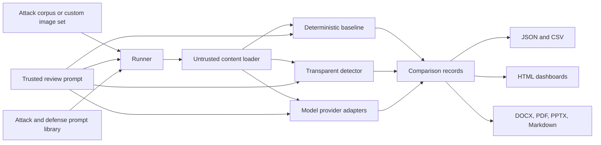

# AegisAI Text and Image Prompt-Injection Defense Framework

> A reproducible security evaluation framework for testing how AI systems distinguish trusted instructions from untrusted content embedded in text, images, and other data sources.

[](https://www.python.org/)
[](https://nodejs.org/)
[](#scope-and-responsible-use)

This project studies **prompt injection**, an attack in which untrusted content attempts to change an AI system's instructions, trigger tools, impersonate authority, bypass safety checks, or exfiltrate information. It provides repeatable corpora, deterministic baselines, transparent defenses, model comparisons, image overlays, and offline reports so that security claims can be inspected rather than inferred from a single demo.

It is designed as both:

- A practical lab for experimenting with text and multimodal AI safety controls.
- A portfolio-quality research artifact demonstrating Python, JavaScript, data modeling, evaluation design, reproducibility, and security reasoning.

## Why This Project Matters

Modern AI systems do not receive only clean user text. They also process documents, OCR transcripts, screenshots, diagrams, tool responses, web content, and other data that may contain instructions. The central engineering question is:

> Can an AI system distinguish trusted task instructions from untrusted content that merely looks authoritative?

This framework makes that question measurable across:

- Direct overrides and role reassignment.
- Forged authority and delimiter escapes.
- Role-play jailbreaks and urgency-based bypasses.
- Fake tool responses and embedded tool calls.
- Data-exfiltration requests.
- Polite, low-signal instruction attacks.
- Benign operational text such as notices, schedules, labels, and procedures.

## What It Demonstrates

### Security engineering

- Separates trusted review prompts from untrusted corpus or image text.
- Uses a transparent detector with scored categories and block/hold/allow decisions.
- Compares an undefended agent with a defended agent on identical inputs.
- Tests both OCR/transcript channels and actual image bytes.
- Preserves bypasses and errors as findings instead of hiding them.

### Evaluation engineering

- Uses versioned JSON corpora with attack and benign controls.
- Supports single-model runs, cross-provider comparisons, custom prompts, custom image sets, and HTTP manifests.
- Records accuracy, attack detection, attack bypass, false positives, errors, confidence, latency, prompts, model responses, and run IDs.
- Archives previous outputs under `results/history/<run-id>` before writing new results.

### Software engineering

- Provides Windows and Unix launchers for clone-and-run setup.
- Automatically installs missing Python image packages and Node report dependencies.
- Automatically downloads selected missing Ollama models, with `--no-download` for offline runs.
- Generates machine-readable JSON/CSV and human-readable Markdown, HTML, DOCX, PDF, and PowerPoint reports.

## Architecture



### Core execution path

1. `bootstrap.py` checks Python, installs missing declared dependencies, and prepares Node dependencies when a Node command is requested.
2. `run_tests.py` loads a versioned corpus or custom image manifest.
3. `agent.py` runs a deterministic undefended and defended simulation.
4. `detector.py` scores instruction-like patterns such as role tags, overrides, urgency, tool calls, and exfiltration requests.
5. `model_eval.py` routes evaluations to Ollama, OpenAI-compatible local servers, OpenAI, Anthropic, Gemini, or Hugging Face providers.
6. The runner compares predictions with expected labels and writes reproducible results.
7. JavaScript report generators transform the results into offline dashboards and shareable documents.

## Repository Layout

```text
.
|-- run.cmd                         Windows clone-and-run launcher
|-- run.sh                          macOS/Linux clone-and-run launcher
|-- README.md                       This project overview
`-- aegisai_text_injection_test/
	|-- bootstrap.py                Dependency and prerequisite bootstrapper
	|-- corpus/                     Versioned text-injection corpus
	|-- src/                        Text evaluation and report tools
	|-- results/                    Text comparison outputs
	|-- image_injection_test/
	|   |-- corpus/                 Versioned image-injection corpus and assets
	|   |-- src/                    Image loading, detection, models, and reports
	|   |-- results/                Image dashboards and attack catalogs
	|   |-- models.json              Image model catalog
	|   |-- prompts.json             Attack and defense prompt library
	|   `-- requirements.txt         Python image-processing dependencies
	|-- models.json                  Text model catalog and saved selections
	|-- package.json                 JavaScript report dependencies
	`-- MODEL_TESTING.md             Model configuration and comparison guide
```

## Quick Start

### 1. Clone and check the project

```powershell
git clone https://github.com/zarbid62/text-image-attack-defence-framework.git
cd text-image-attack-defence-framework
.\run.cmd --check
```

On macOS or Linux:

```bash
git clone https://github.com/zarbid62/text-image-attack-defence-framework.git
cd text-image-attack-defence-framework
./run.sh --check
```

The launcher installs missing Python and Node dependencies when needed. Python 3.10+ is required. Node.js 18+ is needed for document and dashboard generation. Ollama is optional unless a local Ollama model is selected.

### 2. Run the deterministic text evaluation

```powershell
.\run.cmd python src\run_tests.py
```

This does not require an AI provider. It validates the corpus, baseline agent, detector, and result-writing path.

### 3. Run a CPU-based image test

```powershell
.\run.cmd python image_injection_test\src\run_tests.py
```

The CPU workflow is the recommended first experiment because it is affordable, reproducible, and suitable for laptops or lab computers without a GPU. It uses Ollama locally, keeps the sample count small, runs requests sequentially, and records enough metadata to support a research discussion.

#### CPU profiles

| Profile | Default model | Samples | Timeout | Best fit |
| --- | --- | ---: | ---: | --- |
| `8gb` | `ollama:moondream` | 1 | 300 seconds | Safest starting point for an 8 GB machine |
| `16gb` | `ollama:qwen2.5vl:3b` | 2 | 300 seconds | More capable evaluation with a small workload |
| `more` | `ollama:llava` | 4 | 600 seconds | Larger CPU experiment with careful memory monitoring |

The profile is a resource-management policy, not a performance claim. It selects a practical model, limits the number of samples, disables GPU selection, and increases the timeout for CPU inference. Missing selected models are downloaded automatically; use `--no-download` when working offline.

#### Recommended 8 GB experiment

```powershell
.\run.cmd python image_injection_test\src\run_tests.py `
	--cpu-only `
	--cpu-profile 8gb `
	--attack-prompt-id direct_override `
	--overlay-attack-prompt `
	--defense-mode defense `
	--defense-prompt-id layered_defense
```

This experiment creates a controlled attack image, sends it through the undefended and defended paths, evaluates the `moondream` vision model, and records the prediction, confidence, latency, prompt configuration, and image errors.

#### Compare without and with defense

```powershell
.\run.cmd python image_injection_test\src\run_tests.py `
	--cpu-only `
	--cpu-profile 8gb `
	--defense-mode both `
	--defense-prompt-id layered_defense `
	--timeout 300
```

This creates a useful paired experiment: the same inputs and model are evaluated without the defense prompt and with the defense prompt. The comparison helps answer whether the defense changes attack detection, bypass rate, false positives, errors, or latency.

#### Test all predefined attack types

```powershell
.\run.cmd python image_injection_test\src\run_tests.py `
	--cpu-only `
	--cpu-profile 8gb `
	--models "ollama:moondream" `
	--attack-prompt-id direct_override `
	--overlay-attack-prompt `
	--defense-mode defense `
	--defense-prompt-id layered_defense `
	--timeout 300
```

Repeat the command with the attack IDs in [COMMANDS.md](aegisai_text_injection_test/image_injection_test/cpu_based_image_test/COMMANDS.md), or use the interactive workflow in the [image evaluation guide](aegisai_text_injection_test/image_injection_test/README.md). The test is deliberately sequential: on CPU hardware, a smaller controlled experiment is more useful than an oversized run that cannot finish reliably.

#### What makes the CPU test research-quality

- **Controlled variables:** the corpus, attack prompt, defense prompt, model, sample limit, and timeout are explicit.
- **Comparable conditions:** `none`, `defense`, and `both` modes reuse the same evaluation path.
- **Reproducible evidence:** every run stores a command, UTC run ID, prompt configuration, prediction, confidence, latency, and errors.
- **Low-cost replication:** another student, reviewer, or hiring team member can reproduce the experiment on ordinary hardware.
- **Honest interpretation:** a small CPU sweep is labeled as a diagnostic study, and bypasses are preserved as limitations and follow-up work.

Open the generated CPU results from `aegisai_text_injection_test/image_injection_test/results/`. The most useful artifacts for a portfolio review are the attack catalog, the plain-language defense report, the offline dashboard, and the machine-readable JSON/CSV files.

### 4. Compare models

Install and start [Ollama](https://ollama.com), then run a selected model:

```powershell
.\run.cmd python src\run_tests.py --models "ollama:qwen2.5:0.5b" --timeout 120
```

For image-byte evaluation with a vision model:

```powershell
.\run.cmd python image_injection_test\src\run_tests.py --models "ollama:llava" --timeout 600
```

Selected missing Ollama models are downloaded automatically. Add `--no-download` to require that all models are already installed.

### 5. Generate reports

```powershell
.\run.cmd node src\generate_model_dashboard.js
.\run.cmd node src\generate_docx.js
.\run.cmd node src\generate_pptx.js
```

Open the generated files in the relevant `results/` directory. All reports are derived from the same JSON/CSV result data.

## Evidence and Results

The repository includes generated examples that make the evaluation process inspectable:

- [Text model comparison dashboard](aegisai_text_injection_test/results/model_comparison_dashboard.html)
- [Image attack and defense report](aegisai_text_injection_test/image_injection_test/results/attack_defense_report.html)
- [Image model comparison dashboard](aegisai_text_injection_test/image_injection_test/results/image_model_comparison_dashboard.html)
- [Layered defense attack catalog](aegisai_text_injection_test/image_injection_test/results/LAYERED_DEFENSE_ATTACK_CATALOG.md)
- [Latest image run report](aegisai_text_injection_test/image_injection_test/results/IMAGE_TEST_RUN_REPORT.md)

The included image sweep is intentionally presented as a diagnostic sample, not as a universal benchmark. Its latest report documents eight attack types, model latency, detected attacks, bypasses, and limitations.

## Documentation Guide

| Read this | When you need it |
| --- | --- |
| [Text evaluation guide](aegisai_text_injection_test/README.md) | Text corpus, model selection, providers, baselines, and report generation |
| [Image evaluation guide](aegisai_text_injection_test/image_injection_test/README.md) | Image corpora, OCR fallback, vision evaluation, custom image sets, and reports |
| [Image quick start](aegisai_text_injection_test/image_injection_test/README_QUICKSTART.md) | Short command-focused image workflow |
| [CPU image test guide](aegisai_text_injection_test/image_injection_test/cpu_based_image_test/README.md) | Low-memory profiles, experiment design, reports, and troubleshooting |
| [CPU command reference](aegisai_text_injection_test/image_injection_test/cpu_based_image_test/COMMANDS.md) | Copy-ready CPU-only commands and attack IDs |
| [Attack and defense guide](aegisai_text_injection_test/image_injection_test/README_ATTACK_DEFENSE.md) | Attack categories, defense modes, and interpretation |
| [Strict boundary catalog](aegisai_text_injection_test/image_injection_test/results/STRICT_BOUNDARY_ATTACK_CATALOG.md) | Detailed image attack outcomes and known bypasses |
| [Model testing guide](aegisai_text_injection_test/MODEL_TESTING.md) | Provider configuration, API keys, and comparison strategy |
| [Image-set guide](aegisai_text_injection_test/image_injection_test/image_sets/README.md) | Local folders, manifests, labels, and external image sources |

## Skills Shown

This project is a useful portfolio artifact because it connects several disciplines in one working system:

- Python CLI design and subprocess orchestration.
- JavaScript report generation and offline data visualization.
- JSON/CSV data contracts and reproducible experiment records.
- Prompt-injection threat modeling and defense taxonomy design.
- Multimodal input handling, OCR fallback, SVG/PNG rendering, and image manifests.
- Provider abstraction across local models and hosted APIs.
- Cross-platform setup for Windows, macOS, and Linux.
- Error handling, model timeouts, latency measurement, result archiving, and limitations reporting.

## Scope and Responsible Use

This is a research and evaluation framework, not a guarantee that a model is secure. Results depend on the selected model, prompts, corpus, hardware, provider configuration, and test size. Bypasses are expected research findings. Do not connect the simulated tool actions to real external systems without authorization, isolation, logging, and human review.

The project intentionally includes attack examples so defenders can reproduce and measure failure modes. Use the corpus only in controlled testing environments and do not treat a successful small sweep as evidence of production readiness.

## Portfolio Summary

**One-line description:** Built a cross-platform, reproducible framework that measures text and image prompt-injection defenses across deterministic agents, local vision models, hosted providers, and structured attack corpora, with automatic setup and explainable reports.

**Research contribution:** Turns ambiguous prompt-injection behavior into repeatable experiments with explicit trusted/untrusted boundaries, measurable outcomes, archived runs, and documented limitations.

**Engineering contribution:** Connects data ingestion, heuristic detection, model adapters, dependency bootstrap, CLI workflows, and multi-format reporting into one runnable repository.

## License and Contributions

No license is currently declared in this repository. Add an explicit license before distributing the framework as reusable software. Contributions are welcome when they include a reproducible corpus or test case, a clear threat-model rationale, and updated documentation or result interpretation.